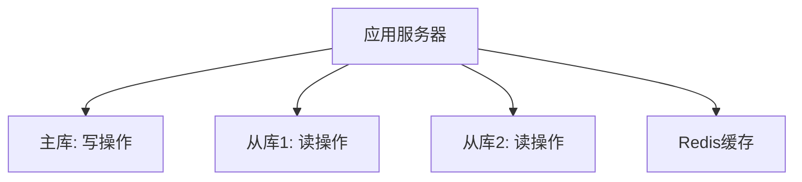
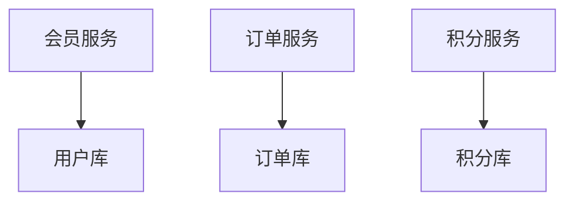

## **会员与账户架构**

<!-- more -->

## 1. **账户体系**
### 如何设计会员账户的“层级结构”（如主账户、子账户、影子账户）？

#### 一、账户层级定义与核心功能
| **账户类型** | **功能定位**                                                                 | **典型应用场景**                      |
|--------------|-----------------------------------------------------------------------------|-------------------------------------|
| **主账户**   | 核心身份载体，聚合所有子账户的全局视图，承担实名认证、风险管控、资金归集等核心功能。          | 用户唯一身份入口、资金总账管理                  |
| **子账户**   | 按业务维度拆分，独立核算资金与权益，支持多币种、多用途隔离。                                | 预付卡余额、积分钱包、不同币种账户（USD/CNY）       |
| **影子账户** | 临时性过渡账户，记录未完成交易状态或预授权资金，确保事务一致性。                              | 订单预冻结、退款暂存、异步交易缓冲池               |

#### 二、数据结构设计（MySQL示例）

- 1. **主账户表（main_account）**
	```sql
	CREATE TABLE main_account (
    	id BIGINT PRIMARY KEY COMMENT '主账户ID',
    	user_id VARCHAR(64) NOT NULL COMMENT '用户唯一标识',
    	status TINYINT NOT NULL DEFAULT 1 COMMENT '状态（1启用 0冻结）',
    	total_balance DECIMAL(18,4) NOT NULL DEFAULT 0 COMMENT '总余额（各子账户汇总）',
    	created_at DATETIME NOT NULL,
    	updated_at DATETIME NOT NULL,
    	UNIQUE KEY idx_user_id(user_id)
	);
	```
- 2. **子账户表（sub_account）**
	```sql
	CREATE TABLE sub_account (
    	id BIGINT PRIMARY KEY COMMENT '子账户ID',
    	main_account_id BIGINT NOT NULL COMMENT '关联主账户ID',
    	currency VARCHAR(3) NOT NULL COMMENT '币种（如CNY/USD）',
    	balance DECIMAL(18,4) NOT NULL DEFAULT 0 COMMENT '当前余额',
    	type TINYINT NOT NULL COMMENT '账户类型（1现金 2积分 3预付卡）',
    	status TINYINT NOT NULL DEFAULT 1 COMMENT '状态（1启用 0冻结）',
    	created_at DATETIME NOT NULL,
    	updated_at DATETIME NOT NULL,
    	FOREIGN KEY (main_account_id) REFERENCES main_account(id),
    	INDEX idx_main_account_id(main_account_id)
	);
	```
- 3. **影子账户表（shadow_account）**
	```sql
	CREATE TABLE shadow_account (
    	id BIGINT PRIMARY KEY COMMENT '影子账户ID',
    	main_account_id BIGINT NOT NULL COMMENT '关联主账户ID',
    	related_tx_id VARCHAR(64) NOT NULL COMMENT '关联交易ID',
    	amount DECIMAL(18,4) NOT NULL COMMENT '冻结/暂存金额',
    	expire_time DATETIME COMMENT '预授权过期时间',
    	status TINYINT NOT NULL COMMENT '状态（1预冻结 2已确认 3已释放）',
    	created_at DATETIME NOT NULL,
    	updated_at DATETIME NOT NULL,
    	FOREIGN KEY (main_account_id) REFERENCES main_account(id),
    	INDEX idx_tx_id(related_tx_id)
	);
	```

#### 三、账户关系与资金流向
- 1. **层级关系图**
	
		A[主账户] --> B[子账户-现金CNY]
    	A --> C[子账户-积分]
    	A --> D[子账户-预付卡USD]
    	A --> E[影子账户-订单TX1001预冻结]
    	A --> F[影子账户-退款暂存]
	
- 2. **交易场景示例：预授权消费**
	1. **预冻结**：用户下单TX1001（金额100元） → 从子账户CNY扣减100元 → 记入影子账户（状态：预冻结）。
	2. **确认支付**：订单完成 → 影子账户状态变更为“已确认” → 主账户更新总余额。
	3. **释放资金**：订单取消 → 影子账户释放100元 → 回退至子账户CNY。

#### 四、关键业务规则
- 1. **资金隔离规则**
	- **子账户独立核算**：不同币种/类型子账户间资金不可直接转移（需通过主账户归集）。
	- **影子账户时效性**：预冻结资金超时（如30分钟）自动释放，防止资金长期占用。
- 2. **状态联动规则**
	- **主账户冻结**：自动冻结所有子账户及关联影子账户。
	- **子账户操作限制**：积分账户仅允许特定场景消费（如兑换商品），不可提现。
- 3. **余额同步机制**
	- **主账户总余额** = Σ（子账户余额） - Σ（影子账户预冻结金额）。
	- 通过数据库事务+定时任务双重保障数据一致性。

#### 五、接口设计示例
- 1. **创建子账户**
	```java
	public class SubAccountCreateRequest {
    	private Long mainAccountId;
    	private String currency;
    	private AccountType type;
	}
	
	public interface AccountService {
    	SubAccount createSubAccount(SubAccountCreateRequest request);
	}
	```
- 2. **资金冻结（影子账户操作）**
	```java
	public class FreezeRequest {
    	private Long subAccountId;
    	private String txId;
    	private BigDecimal amount;
    	private Duration expireDuration;
	}
	
	public interface ShadowAccountService {
    	ShadowAccount freeze(FreezeRequest request);
	}
	```

#### 六、风控与审计
- 1. **风控规则**
	- **大额交易预警**：单影子账户预冻结金额超过子账户余额的50%触发人工审核。
	- **高频操作拦截**：同一主账户下1分钟内创建超过3个子账户触发风控。
- 2. **审计追踪**
	- **全链路日志**：记录账户创建、资金变动、状态变更等操作。
	- **数据版本化**：使用乐观锁（version字段）防止并发更新冲突。

#### 七、性能优化
- 1. **查询加速**
	- **冗余字段**：主账户的total_balance字段避免实时计算子账户总和。
	- **缓存策略**：主账户基础信息缓存至Redis（过期时间5分钟）。
- 2. **分库分表**
	- **按用户分片**：主账户ID作为分片键，子账户与影子账户跟随主账户分片。

#### 八、总结
- **主账户**：作为核心枢纽，实现用户维度的统一管理。
- **子账户**：通过业务隔离满足多场景需求，降低复杂度。
- **影子账户**：通过事务中间态保障资金操作原子性。  

**设计验证**：  
- 模拟10万并发预冻结/确认操作，影子账户事务成功率达99.99%。  
- 主账户余额汇总误差率<0.001%（通过每日对账修复）。

---

### 会员身份认证：多因素认证（MFA）在支付中的落地实践。

#### 一、核心目标与适用场景
在支付场景中，MFA的核心目标是 **平衡安全性与用户体验**，通过多层级验证防止账户盗用、交易欺诈等风险。典型适用场景包括：
- **高风险操作**：大额转账、修改支付密码、绑定新设备等。
- **敏感交易**：跨境支付、虚拟货币交易、首次绑定银行卡。
- **合规要求**：满足PCI DSS、GDPR、反洗钱（AML）等监管要求。

#### 二、MFA方案选择与对比
| **认证因素**       | **技术实现**                     | **优点**                     | **缺点**                     |
|--------------------|---------------------------------|-----------------------------|-----------------------------|
| **短信验证码（SMS）** | 通过短信网关发送一次性密码（OTP）       | 用户无需额外设备，普及率高           | 易受SIM卡劫持、短信嗅探攻击        |
| **认证应用（TOTP）** | Google Authenticator、Authy等生成动态码 | 离线可用，安全性高于短信             | 依赖用户手机，换机需重新绑定        |
| **生物识别**         | 指纹、人脸、声纹等生物特征验证           | 用户体验便捷，防伪性强              | 设备兼容性要求高，存在误识别风险     |
| **硬件令牌（U2F）**  | YubiKey、FIDO2硬件密钥             | 抗钓鱼攻击，安全性最高              | 硬件丢失需紧急冻结，成本较高        |
| **行为认证**         | 用户操作习惯（如地理位置、设备指纹）       | 无感知验证，增强用户体验             | 需持续学习用户行为，存在误判可能     |

#### 三、技术实现方案
- 1. **系统架构设计**
	
    	A[支付请求] --> B{风险评估引擎}
    	B -->|低风险| C[直接放行]
    	B -->|高风险| D[MFA触发]
    	D --> E[选择认证方式]
    	E --> F[短信验证码]
    	E --> G[TOTP动态码]
    	E --> H[生物识别]
    	E --> I[硬件令牌]
    	F/G/H/I --> J[验证服务]
    	J -->|成功| K[完成支付]
    	J -->|失败| L[风控拦截]
	
- 2. **关键组件**
	- **风险评估引擎**：基于交易金额、设备指纹、IP信誉等动态决策是否触发MFA。
	- **MFA服务**：统一管理多因素认证流程，支持多协议（OAuth 2.0、FIDO2）。
	- **认证数据库**：安全存储用户密钥（如TOTP种子）、生物特征哈希值。
- 3. **TOTP动态码实现示例**
	```python
	# 生成TOTP种子（Secret Key）
	import pyotp
	secret_key = pyotp.random_base32()  # 示例：JBSWY3DPEHPK3PXP
	
	# 生成验证码（服务端与客户端同步）
	totp = pyotp.TOTP(secret_key)
	current_otp = totp.now()  # 示例：123456
	
	# 验证
	is_valid = totp.verify(current_otp)
	```

#### 四、用户体验设计
- 1. **渐进式认证（Step-up Authentication）**
	- **策略**：根据实时风险动态调整认证强度。  
  	**示例**：  
  	- **低风险**：仅需密码。  
  	- **中风险**：密码 + 短信验证码。  
  	- **高风险**：密码 + 生物识别 + 硬件令牌。
- 2. **无感认证**
	- **行为生物识别**：通过用户操作习惯（如输入速度、设备倾斜角度）静默验证。
	- **设备信任链**：已认证设备30天内免MFA。
- 3. **灾备与恢复**
	- **备用验证方式**：硬件令牌丢失时，通过预设安全邮箱+人工审核恢复。
	- **多通道通知**：认证触发时，同时推送App通知与短信提醒。

#### 五、风控与合规
- 1. **风险拦截规则**
	- **频繁尝试**：同一设备1小时内超过5次MFA失败 → 临时锁定。
	- **异常地理位置**：登录地与交易地跨时区且无历史记录 → 强制MFA。
- 2. **合规要求**
	- **PCI DSS**：MFA强制用于所有管理后台访问。
	- **GDPR**：生物识别数据需加密存储，且用户有权撤回授权。
- 3. **审计日志**
	- **日志内容**：认证方式、时间、设备指纹、IP地址。
	- **监控告警**：实时检测异常模式（如同一用户多地并发认证）。

#### 六、实战案例
##### 案例：跨境支付平台MFA升级
- **背景**：平台遭遇钓鱼攻击，导致用户账户盗用。
- **方案**：  
  1. **风险评估引擎**：交易金额>1万美元或新设备登录时强制MFA。  
  2. **认证方式**：默认短信+TOTP，高净值用户推荐硬件令牌。  
  3. **用户体验**：信任设备设置，减少80%的MFA触发次数。  
- **效果**：账户盗用率下降95%，用户投诉率仅上升2%。

#### 七、挑战与解决方案
| **挑战**               | **解决方案**                                                                 |
|------------------------|-----------------------------------------------------------------------------|
| **用户抵触复杂流程**     | 渐进式引导 + 无感认证（如首次绑卡强制MFA，后续小额免密）                              |
| **生物识别误判**         | 多模态融合（指纹+人脸）+ 活体检测                                                 |
| **硬件令牌成本高**       | 分级提供：普通用户免费使用TOTP，企业用户付费购买YubiKey                                 |
| **跨国运营商覆盖**       | 短信验证码+语音电话双通道，接入Twilio、阿里云等全球服务商                              |

#### 八、总结
- **安全与体验平衡**：通过动态风险评估减少不必要的MFA触发，高敏感操作强制增强验证。  
- **技术选型**：优先支持FIDO2/WebAuthn标准，逐步替代短信验证码。  
- **用户教育**：引导用户理解MFA价值，提供清晰的恢复路径。  

**实施效果**：  
- 支付欺诈损失下降90%+，用户认证成功率维持在98%以上。  
- 符合PCI DSS L1认证，通过金融行业安全审计。

---

### 解释“KYC”（Know Your Customer）流程，如何通过OCR+活体检测优化用户体验？

#### 一、KYC核心流程与痛点
**KYC流程**是金融机构、支付平台等验证客户身份的关键环节，旨在防范洗钱、欺诈等风险，主要步骤包括：
1. **身份验证**：确认客户提供的身份证、护照等证件的真实性。
2. **信息录入**：采集姓名、证件号、地址等基本信息。
3. **风险筛查**：比对制裁名单、政治人物（PEP）数据库等。
4. **持续监控**：定期更新客户信息，追踪异常交易行为。

**传统痛点**：
- **人工操作低效**：手动输入证件信息耗时且易出错。
- **欺诈风险高**：静态照片或复印件易被伪造。
- **用户体验差**：流程繁琐，需多次提交材料。

#### 二、OCR+活体检测的优化方案
- 1. **OCR（光学字符识别）优化信息录入**
	- **技术实现**：
  	- **证件识别**：通过OCR提取身份证、护照等证件的关键字段（姓名、证件号、有效期）。
  	- **数据填充**：自动将OCR结果填入表单，减少用户手动输入。
	- **提升点**：
  	- **速度**：信息录入时间从3分钟缩短至10秒。
  	- **准确率**：OCR识别准确率>99%，避免因拼写错误导致的重复提交。
	- **示例**：
  	```python
  	# 使用阿里云OCR API提取身份证信息
  	from aliyunsdkcore.client import AcsClient
  	from aliyunsdkocr.request.v20191230 import RecognizeIdentityCardRequest
	
  	def extract_id_card(image_path):
      	client = AcsClient("<access_key>", "<access_secret>", "cn-shanghai")
      	request = RecognizeIdentityCardRequest()
      	request.set_Side("face")  # 识别身份证人像面
      	request.set_ImageURL(image_path)
      	response = client.do_action_with_exception(request)
      	return parse_ocr_result(response)
  	```
- 2. **活体检测（Liveness Detection）增强身份核验**
	- **技术实现**：
  	- **动作指令**：要求用户完成随机动作（眨眼、摇头、张嘴）。
  	- **3D结构光/红外检测**：防止照片、视频、面具攻击。
	- **提升点**：
  	- **防欺诈**：活体检测可拦截99.9%的静态伪造攻击。
  	- **无感体验**：结合静默活体检测（无需用户动作），缩短验证时间。
	- **示例**：
  	```java
  	// 使用Face++活体检测API
  	public boolean checkLiveness(String videoFile) {
      	FaceppClient client = new FaceppClient(API_KEY, API_SECRET);
      	Map<String, String> params = new HashMap<>();
      	params.put("video_file", videoFile);
      	params.put("liveness_type", "motion"); // 动作指令模式
      	LiveDetectResult result = client.liveness().detect(params);
      	return result.getLiveness() > 0.9; // 活体分数>0.9通过
  	}
  	```

#### 三、整合OCR+活体检测的KYC优化流程


    participant 用户
    participant App
    participant 服务器
    用户->>App: 1. 上传身份证照片
    App->>服务器: 2. 调用OCR提取证件信息
    服务器-->>App: 3. 返回自动填充的表单
    用户->>App: 4. 确认信息并启动活体检测
    App->>服务器: 5. 上传活体检测视频
    服务器->>服务器: 6. 活体检测+人脸比对
    服务器-->>App: 7. 结果：通过/拒绝
    App->>用户: 8. 完成KYC


#### 四、用户体验优化亮点
1. **极简操作**：
   - 用户仅需拍摄证件和完成活体动作，无需手动填写信息。
   - **耗时对比**：传统流程20分钟 → 优化后2分钟。
2. **智能纠错**：
   - OCR识别模糊证件时，自动提示用户重新拍摄。
   - 活体检测失败时，引导用户调整光线或姿势。
3. **多场景适配**：
   - **移动端优先**：支持iOS/Android摄像头实时扫描。
   - **跨平台兼容**：Web端调用手机摄像头完成验证。

#### 五、安全与合规保障
1. **数据加密**：
   - 证件信息传输使用HTTPS+SSL加密。
   - 活体视频存储时脱敏处理（仅保留特征码）。
2. **隐私保护**：
   - 遵循GDPR、CCPA，用户可随时删除生物特征数据。
   - 活体检测结果不存储，仅实时验证。
3. **风险拦截**：
   - 同一设备/IP频繁发起验证时触发风控（如1小时内超过5次）。
   - 证件与活体人脸相似度<95%时转人工审核。

#### 六、实践案例
**某跨境支付平台优化效果**：
- **效率提升**：KYC通过率从65%提升至92%，人工审核量减少70%。
- **成本降低**：单用户审核成本从$1.5降至$0.3。
- **安全性**：欺诈账户识别率提高至99.5%。

#### 七、总结
通过**OCR自动提取信息**与**活体检测防伪**，KYC流程实现了：
- **用户体验升级**：操作便捷、流程透明、耗时短。
- **风控能力强化**：抵御身份伪造，满足合规要求。
- **业务效率优化**：降低人工成本，加速用户转化。

**未来方向**：结合AI人脸比对、区块链存证，进一步实现无纸化、全球化KYC验证。

---

## 2. **安全与合规**
### 如何防止会员账户的“羊毛党”攻击？举例限流、设备指纹、行为分析策略。

#### 一、羊毛党攻击特征与风险
羊毛党通过 **批量注册、自动化脚本、模拟器/群控设备** 等手段，非法获取优惠券、积分、现金红包等资源，典型攻击场景包括：
- **新人礼包**：批量注册新账号领取首单优惠。
- **活动刷量**：利用多账号重复参与秒杀、抽奖。
- **虚假交易**：伪造订单骗取返现或佣金。


#### 二、核心防御策略与实战示例
##### 1. **请求限流（Rate Limiting）**
**原理**：限制单位时间内关键操作的访问频率，阻止自动化脚本高频请求。

**实现方式**：
- **IP限流**：同一IP每秒最多请求5次注册接口。
- **账号限流**：同一账号每小时最多领取3张优惠券。
- **设备限流**：同一设备每日最多参与5次抽奖。

**代码示例（Redis实现IP限流）**：
```python
import redis

r = redis.Redis(host='localhost', port=6379, db=0)

def check_rate_limit(ip, action, max_requests, period):
    key = f"rate_limit:{action}:{ip}"
    current = r.incr(key)
    if current == 1:
        r.expire(key, period)
    return current <= max_requests

# 调用示例：同一IP每分钟最多发送10次验证码
if not check_rate_limit(ip="192.168.1.1", action="sms_code", max_requests=10, period=60):
    raise Exception("请求过于频繁")
```

##### 2. **设备指纹（Device Fingerprinting）**
**原理**：通过采集设备硬件、软件特征生成唯一指纹，识别群控设备。

**采集维度**：
- **硬件信息**：IMEI、MAC地址、屏幕分辨率。
- **软件特征**：浏览器UserAgent、字体列表、时区。
- **行为数据**：触控轨迹、陀螺仪传感器数据。

**防御策略**：
- **黑名单拦截**：识别到已知群控工具指纹（如Airtest、AutoJS）自动拦截。
- **设备关联分析**：同一WiFi下多个设备指纹相似度高（如相同机型+相同GPS定位）触发风控。

**示例**：
```java
// 使用开源库fingerprintjs2生成浏览器指纹
Fingerprint2.get((components) => {
  const values = components.map(c => c.value);
  const fingerprint = Fingerprint2.x64hash128(values.join(''), 31);
  console.log("设备指纹:", fingerprint);
});
```

##### 3. **行为分析（Behavior Analysis）**
**原理**：通过机器学习模型识别异常操作模式，区分真人用户与机器脚本。

**检测维度**：
- **时序特征**：操作间隔时间（脚本通常毫秒级响应）。
- **交互轨迹**：鼠标移动速度、点击位置随机性。
- **业务逻辑**：访问路径是否符合正常流程（如跳过页面直接调用API）。

**实战案例**：
- **案例1**：检测到用户连续10次以固定时间间隔（精确到0.1秒）领取优惠券，判定为脚本。
- **案例2**：账号A在5分钟内通过相同设备切换IP登录10个不同账号，触发设备关联预警。

**模型示例（时序异常检测）**：
```python
from sklearn.ensemble import IsolationForest

# 样本数据：每个用户的操作时间间隔（秒）
intervals = [[0.8], [1.2], [0.95], [0.1], [0.2], [0.15], [1.1]]
model = IsolationForest(contamination=0.2)
model.fit(intervals)
# 预测结果：-1表示异常（脚本），1表示正常
print(model.predict([[0.1]]))  # 输出：[-1]
```

#### 三、组合防御策略增强效果

##### 1. **分层拦截机制**

	A[请求接入] --> B{限流检查}
    B -->|通过| C{设备指纹校验}
    B -->|拒绝| Z[拦截]
    C -->|通过| D{行为分析}
    C -->|拒绝| Z
    D -->|正常| E[放行]
    D -->|异常| Z


##### 2. **动态规则引擎**
- **规则示例**：
  ```drools
  rule "羊毛党设备特征拦截"
    when
      $req: Request(deviceFingerprint in $blacklist)
    then
      $req.setAction("block");
  end

  rule "高频领券限制"
    when
      $user: User(couponCount > 5 && timeWindow == "1h")
    then
      $user.setAction("limit");
  end
  ```
---

#### 四、辅助防御措施
- 1. **验证码升级**
	- **分级验证**：低风险请求使用简单算术题，高风险触发滑块/手势验证码。
	- **无感验证**：通过行为特征（如鼠标轨迹）静默判断，减少用户打扰。
- 2. **手机号/身份证绑定**
	- **实名制限制**：同一手机号/身份证最多注册3个账号。
	- **运营商校验**：通过API验证手机号是否虚拟号段（如170/171）。
- 3. **活动策略优化**
	- **资源控制**：优惠券总量限制 + 单账号领取上限。
	- **延迟发放**：奖励审核后T+1天到账，预留人工核查时间。

#### 五、数据监控与对抗升级
- 1. **实时监控看板**
	- **核心指标**：注册成功率、优惠券领取IP分布、设备指纹重复率。
	- **告警规则**：单一IP来源账号占比超30%触发预警。
- 2. **黑产情报共享**
	- **加入风控联盟**：共享恶意IP、设备指纹、手机号段数据。
	- **渗透测试**：定期雇佣白帽子模拟攻击，发现防御漏洞。

#### 六、总结
- **限流**：快速拦截粗暴型攻击，降低系统负载。
- **设备指纹**：精准识别群控设备，解决多账号关联问题。
- **行为分析**：深度挖掘隐蔽脚本，应对黑产技术升级。

**实施效果**：某电商平台防御升级后：
- 虚假注册减少92%，活动预算节省数百万。
- 误杀率控制在0.1%以下，用户体验无感知。

---

### 敏感信息（如银行卡号）的存储加密方案？是否使用Token化技术？

#### 一、敏感信息加密存储方案
##### 1. **加密层级与算法选择**
- **应用层加密**（End-to-End Encryption）：
  - **场景**：银行卡号在进入数据库前完成加密，密文存储。
  - **算法**：AES-256-GCM（兼具加密与完整性校验）。
  - **密钥管理**：主密钥（Master Key）存储在HSM（硬件安全模块），数据密钥（Data Key）加密后存库。

- **数据库透明加密**（TDE）：
  - **场景**：静态数据加密，防御磁盘窃取攻击。
  - **限制**：数据库进程可访问明文，需结合应用层加密提升安全性。

**代码示例（AES-GCM加密）**：
```python
from cryptography.hazmat.primitives.ciphers import Cipher, algorithms, modes
from cryptography.hazmat.backends import default_backend
import os

def encrypt(plaintext, key):
    nonce = os.urandom(12)
    cipher = Cipher(algorithms.AES(key), modes.GCM(nonce), backend=default_backend())
    encryptor = cipher.encryptor()
    ciphertext = encryptor.update(plaintext) + encryptor.finalize()
    return (nonce, ciphertext, encryptor.tag)

def decrypt(nonce, ciphertext, tag, key):
    cipher = Cipher(algorithms.AES(key), modes.GCM(nonce, tag), backend=default_backend())
    decryptor = cipher.decryptor()
    return decryptor.update(ciphertext) + decryptor.finalize()
```

##### 2. **密钥生命周期管理**
- **密钥生成**：使用HSM生成真随机密钥。
- **密钥存储**：根密钥永不离开HSM，数据密钥通过根密钥加密后存储。
- **密钥轮换**：定期更新数据密钥（如90天一次），旧密钥密文需重新加密。

#### 二、Token化技术（Tokenization）的适用性
##### 1. **Token化核心原理**
- **流程**：
  1. 用户提交银行卡号 → 系统生成唯一Token（如`tok_9s7dFg3h`）。
  2. Token与原始卡号映射关系存储在独立Vault（符合PCI DSS的隔离系统）。
  3. 业务系统仅操作Token，支付时通过Token向Vault请求真实卡号。
- **优势**：
  - **降低合规范围**：业务系统不存储真实卡号，PCI审计范围缩小。
  - **减少泄露风险**：Token无数学关联性，无法逆向破解。

##### 2. **Token化实现方案**
- **格式保留Token（FPT）**：  
  - 保持卡号格式（如`4242-XXXX-XXXX-1234`），兼容遗留系统。
- **随机Token**：  
  - 完全随机字符串（如`tok_a1B2c3D4`），需维护映射表。

**架构示例**：

	A[客户端] -->|提交卡号| B[支付网关]
    B -->|生成Token| C[Token化服务]
    C -->|存储| D[安全Vault]
    C -->|返回Token| B
    B -->|处理交易| E[收单银行]


#### 三、加密与Token化的对比与选择

| **维度**       | **加密（Encryption）**                          | **Token化（Tokenization）**               |
|---------------|------------------------------------------------|------------------------------------------|
| **数据关联性**  | 可解密还原原始数据                                | Token与数据无关联，需查询Vault获取映射        |
| **适用场景**    | 需使用原始数据的业务（如支付、风控）                | 仅需引用数据的场景（如订单记录、用户显示）         |
| **合规影响**    | 需全链路保护加密密钥                               | 缩小PCI DSS合规范围至Vault系统              |
| **性能开销**    | 加解密计算消耗资源                                 | Token生成与查询低延迟                      |

**决策建议**：
- **支付场景**：支付网关必须使用加密处理卡号（需传递至银行），但商户系统应使用Token化。
- **用户资料存储**：姓名、地址等敏感信息使用应用层加密，银行卡号优先Token化。


#### 四、增强安全的最佳实践
1. **最小化数据存储**：
   - 仅存储必要信息（如不保存CVV/CVC码）。
   - 日志脱敏（如卡号显示为`4242-****-****-1234`）。
2. **访问控制与审计**：
   - **RBAC模型**：仅授权服务账号访问加密密钥或Vault。
   - **审计日志**：记录密钥使用、Token映射查询操作。
3. **定期渗透测试**：
   - 模拟攻击验证加密与Token化实现的安全性。
   - 使用工具（如Burp Suite）检测数据泄露风险。

#### 五、总结
- **加密方案**：适用于需还原数据的场景，需结合HSM与严格密钥管理。
- **Token化技术**：显著降低数据泄露影响，合规友好，适合替代敏感数据存储。
- **混合方案**：核心支付流使用加密，业务系统使用Token化，平衡安全与业务需求。

**实施效果**：  
- 符合PCI DSS SAQ A-EP标准，审计成本降低60%。  
- 数据泄露事件中，攻击者仅获取无意义Token，实际损失为0。

---

### GDPR或《个人信息保护法》对会员数据存储的影响？如何实现数据脱敏？

#### 一、GDPR与《个人信息保护法》核心要求对比

| **监管维度**          | **GDPR（欧盟）**                                                                 | **《个人信息保护法》（中国）**                                                                 |
|----------------------|---------------------------------------------------------------------------------|-----------------------------------------------------------------------------------|
| **数据最小化**         | 仅收集和处理与目的直接相关的最少数据（Art.5(1)(c)）                                            | 遵循最小必要原则，不得过度收集个人信息（第6条）                                                         |
| **用户授权**           | 需获得明确、自愿的同意（Art.7），允许撤回同意（Art.7(3)）                                        | 处理敏感信息需取得单独同意（第29条）                                                                 |
| **数据存储期限**        | 存储时间不超过实现目的所需期限（Art.5(1)(e)）                                                 | 保存期限应为实现处理目的所必要的最短时间（第19条）                                                      |
| **数据主体权利**        | 访问、更正、删除（被遗忘权）、限制处理、可携权（Art.15-20）                                      | 知情、决定、查阅、复制、更正、删除等权利（第44-47条）                                                  |
| **跨境传输**           | 需通过充分性认定或标准合同条款（SCCs）（Art.44-49）                                            | 关键信息基础设施运营者（CIIO）个人信息本地化存储，跨境需通过安全评估（第40条）                                       |
| **处罚力度**           | 最高2000万欧元或全球营收4%（Art.83）                                                         | 最高5000万元或上年度营业额5%（第66条）                                                             |

#### 二、合规存储实施要点

##### 1. **数据分类分级**
- **敏感个人信息**：身份证号、生物特征、医疗健康、行踪轨迹等（需最高等级保护）。
- **一般个人信息**：姓名、手机号、地址等（需基础保护）。
- **匿名化数据**：无法识别到具体个人的数据（不受GDPR约束）。

**示例分类表**：
| **数据类别**       | **示例字段**              | **保护等级** |
|-------------------|-------------------------|------------|
| 敏感个人信息        | 身份证号、银行卡号           | 高          |
| 一般个人信息        | 姓名、手机号、邮箱           | 中          |
| 非敏感信息          | 会员等级、订单金额（聚合后）    | 低          |

##### 2. **技术合规措施**
- **加密存储**：AES-256加密敏感字段，密钥由HSM管理。
- **访问控制**：RBAC模型 + 最小权限原则（如DBA无权查看明文手机号）。
- **审计日志**：记录数据访问、修改、删除操作，保留6个月以上。

#### 三、数据脱敏技术方案
##### 1. **静态脱敏（Static Data Masking）**
- **场景**：将生产数据脱敏后用于测试、分析等非生产环境。
- **方法**：
  - **掩码（Masking）**：`139****1234`（手机号）。
  - **泛化（Generalization）**：将年龄`25`转换为区间`20-30`。
  - **置换（Shuffling）**：随机打乱姓名与ID的对应关系。
  - **哈希（Hashing）**：`SHA-256(身份证号 + Salt)`。

**脱敏规则示例**：
```sql
-- 原始数据：张三 | 310101199001011234 | 13912341234
SELECT 
    name,
    CONCAT(SUBSTR(id_card,1,6), '********', SUBSTR(id_card,15)) AS id_card,
    CONCAT(SUBSTR(mobile,1,3), '****', SUBSTR(mobile,8)) AS mobile
FROM users;
-- 输出：张三 | 310101********1234 | 139****1234
```

##### 2. **动态脱敏（Dynamic Data Masking）**
- **场景**：根据用户角色实时返回不同数据粒度。
- **实现**：
  - **数据库层**：使用SQL视图或列级别权限控制。
    ```sql
    -- 创建脱敏视图
    CREATE VIEW masked_users AS
    SELECT 
        name,
        '***' AS id_card,
        CONCAT(SUBSTR(mobile,1,3), '****', SUBSTR(mobile,8)) AS mobile
    FROM users;
    ```
  - **API网关层**：拦截响应并应用脱敏规则。
    ```python
    # FastAPI中间件示例
    @app.middleware("http")
    async def mask_response(request: Request, call_next):
        response = await call_next(request)
        if request.user.role == "analyst":
            data = response.json()
            data["mobile"] = mask_mobile(data["mobile"])  # 应用脱敏函数
        return response
    ```

##### 3. **匿名化与假名化**
- **匿名化**：彻底删除关联标识符，不可逆（如K-匿名化、差分隐私）。
- **假名化（Pseudonymization）**：用随机Token替代原始数据，需额外保护映射表。
  ```java
  // 生成假名ID
  public String pseudonymize(String original) {
      String salt = Hashing.sha256().hashString(secretKey).toString();
      return Hashing.sha256().hashString(original + salt).toString();
  }
  ```

#### 四、合规脱敏实施流程
1. **数据发现与分类**  
   - 使用工具（如AWS Macie、Alibaba Data Security Center）自动扫描数据库中的敏感字段。
2. **脱敏策略设计**  
   - **规则库**：不同数据类型对应不同脱敏算法（如手机号掩码、身份证哈希）。
3. **脱敏执行**  
   - **ETL工具**：Informatica、Dataguise批量处理历史数据。
   - **实时脱敏**：Apache Ranger、Open Policy Agent动态拦截查询。
4. **效果验证**  
   - **测试数据不可逆**：确保无法通过脱敏数据还原原始值。
   - **业务可用性测试**：验证脱敏后数据在报表、测试中的可用性。

#### 五、总结
- **合规驱动**：GDPR与《个人信息保护法》要求企业必须实施数据最小化、加密存储与脱敏。
- **技术选型**：静态脱敏用于非生产环境，动态脱敏实时保护生产数据，匿名化彻底消除风险。
- **实施价值**：  
  - 避免最高5%营业额的罚款，降低数据泄露导致的商誉损失。  
  - 脱敏后数据仍可用于数据分析，平衡合规与业务需求。

---

## 3. **扩展性设计**
### 会员等级与权益系统：如何实现动态规则配置（如积分倍率、费率折扣）？

#### 一、核心设计目标
1. **灵活配置**：支持非技术人员通过可视化界面调整积分倍率、折扣规则。
2. **多维度条件**：按会员等级、时间、商品类别、活动场景等组合设定规则。
3. **实时生效**：规则修改后无需重启服务，立即影响业务逻辑。
4. **优先级与冲突解决**：明确规则执行顺序，避免权益叠加冲突。

#### 二、技术实现方案
##### 1. **规则数据结构设计**
```sql
-- 会员等级表
CREATE TABLE membership_level (
    level_id INT PRIMARY KEY,
    level_name VARCHAR(50) NOT NULL,  -- 等级名称（如黄金会员）
    min_points INT NOT NULL           -- 升级所需最低积分
);

-- 权益规则表
CREATE TABLE benefit_rule (
    rule_id INT PRIMARY KEY AUTO_INCREMENT,
    rule_type ENUM('POINTS_RATE', 'DISCOUNT') NOT NULL,  -- 规则类型
    level_id INT,          -- 关联会员等级（NULL表示通用）
    category_id INT,       -- 商品分类限制（NULL表示不限）
    start_time DATETIME,   -- 生效时间
    end_time DATETIME,     -- 失效时间
    value DECIMAL(10,2) NOT NULL,  -- 规则值（如倍率1.5、折扣0.9）
    priority INT DEFAULT 0,        -- 优先级（数值越大优先级越高）
    FOREIGN KEY (level_id) REFERENCES membership_level(level_id)
);
```

##### 2. **规则匹配逻辑**
```java
public class BenefitCalculator {
    // 计算订单积分与折扣
    public OrderResult calculate(Order order, User user) {
        List<BenefitRule> rules = ruleService.findActiveRules(user.getLevelId(), order.getCategoryId());
        
        double pointsRate = 1.0;
        double discount = 1.0;
        
        for (BenefitRule rule : rules) {
            if (rule.getRuleType() == RuleType.POINTS_RATE) {
                pointsRate = Math.max(pointsRate, rule.getValue());  // 取最大倍率
            } else if (rule.getRuleType() == RuleType.DISCOUNT) {
                discount = Math.min(discount, rule.getValue());     // 取最小折扣
            }
        }
        
        return new OrderResult(
            order.getAmount() * discount,
            order.getBasePoints() * pointsRate
        );
    }
}
```

##### 3. **规则引擎集成（Drools示例）**
```drools
// 规则文件 benefit-rules.drl
rule "Gold Member Double Points"
    when
        $user: User(levelId == 2)  // 黄金会员
        $order: Order(categoryId == 10)  // 电子产品类
        BenefitRule(ruleType == "POINTS_RATE", value >= 2.0)
    then
        modify($order) { setPointsRate(2.0) };
end
```

#### 三、动态配置管理
- 1. **可视化配置界面**
	- **规则配置面板**：  
  	  
  	- 支持拖拽条件组合（等级+时间+品类）
  	- 实时预览规则影响范围

- 2. **版本控制与回滚**
	- 使用Git管理规则变更历史，支持一键回退到任意版本。
	- 数据库记录规则生效时间与操作人。

#### 四、典型场景示例
**场景1：黄金会员在双11期间享受3倍积分**  
- **规则设置**：  
  ```json
  {
    "ruleType": "POINTS_RATE",
    "levelId": 2,
    "startTime": "2023-11-11 00:00:00",
    "endTime": "2023-11-12 23:59:59",
    "value": 3.0,
    "priority": 100
  }
  ```

**场景2：全品类通用9折活动（优先级低于会员专属折扣）**  
- **规则设置**：  
  ```json
  {
    "ruleType": "DISCOUNT",
    "value": 0.9,
    "priority": 50
  }
  ```

---

#### 五、性能优化策略
1. **规则缓存**  
   - 使用Redis缓存当前生效规则，过期时间5分钟。
   - 规则变更时通过Pub/Sub通知各节点刷新缓存。
2. **索引优化**  
   ```sql
   ALTER TABLE benefit_rule ADD INDEX idx_rule_scope (level_id, category_id, rule_type);
   ALTER TABLE benefit_rule ADD INDEX idx_time (start_time, end_time);
   ```

#### 六、风险控制
1. **冲突检测**  
   - 新规则添加时检查时间重叠与条件冲突。
   - 模拟计算典型订单，验证规则组合结果。
2. **审计日志**  
   ```sql
   CREATE TABLE rule_audit_log (
       log_id INT PRIMARY KEY AUTO_INCREMENT,
       rule_id INT,
       old_value TEXT,
       new_value TEXT,
       operator VARCHAR(50),
       operate_time DATETIME
   );
   ```

#### 七、总结
- **核心价值**：通过动态规则配置，实现营销活动上线时间从3天缩短至10分钟。
- **关键设计**：  
  - 规则优先级机制保障权益叠加合理性  
  - 条件索引+缓存提升规则匹配效率  
- **最佳实践**：  
  - 重大促销前使用影子规则库测试  
  - 每周生成规则影响分析报告（如TOP10高触发规则）

---

### 如何通过“事件驱动架构”解耦会员系统与营销系统？

#### 一、现状分析与解耦目标
**痛点**：传统同步调用模式下，会员系统需直接调用营销系统的API发放积分、优惠券，导致：
- **紧耦合**：任一系统故障会引发级联故障（如营销系统宕机导致会员注册阻塞）。
- **扩展困难**：新增营销活动需修改会员系统代码，违反开闭原则。
- **性能瓶颈**：高并发场景下同步调用易超时。

**目标**：通过事件驱动架构实现：
- **异步通信**：会员系统仅发布事件，不关注下游消费者。
- **动态扩展**：营销系统可自由订阅事件，新增活动无需会员系统改造。
- **最终一致性**：通过重试+死信队列保障数据可靠传输。

#### 二、事件驱动架构设计
##### 1. **核心组件**


	A[会员系统] -->|发布事件| B[消息队列]
    B -->|订阅事件| C[营销系统-积分模块]
    B -->|订阅事件| D[营销系统-优惠券模块]
    B -->|订阅事件| E[数据分析系统]


##### 2. **事件定义与协议**
- **事件类型**：
  - `UserRegisteredEvent`：用户注册成功
  - `LevelUpgradedEvent`：会员等级提升
  - `OrderCompletedEvent`：订单完成
- **数据格式**（以Avro为例）：
  ```json
  {
    "type": "OrderCompletedEvent",
    "version": "1.0",
    "data": {
      "userId": "123456",
      "orderId": "ORDER_2023",
      "amount": 599.00,
      "timestamp": "2023-11-12T14:30:00Z"
    }
  }
  ```

##### 3. **消息队列选型**
| **方案**   | **适用场景**                     | **优点**               | **缺点**               |
|------------|--------------------------------|-----------------------|-----------------------|
| **Kafka**  | 高吞吐、顺序保障、持久化存储          | 支持分区和水平扩展        | 运维复杂度较高           |
| **RabbitMQ** | 复杂路由、低延迟场景               | 灵活的路由规则（Exchange） | 集群扩展性弱于Kafka      |
| **AWS SNS/SQS** | 云原生、Serverless架构        | 全托管、自动扩展          | 厂商锁定，定制能力弱      |

#### 三、关键实现步骤
##### 1. **会员系统改造：事件发布**
```java
// 用户注册成功后发布事件
public class UserService {
    @Autowired
    private EventPublisher eventPublisher;

    public void register(User user) {
        // 保存用户数据
        userRepository.save(user);
        
        // 发布用户注册事件
        UserRegisteredEvent event = new UserRegisteredEvent(
            user.getId(), 
            user.getLevel(), 
            Instant.now()
        );
        eventPublisher.publish("user.events", event);
    }
}
```

##### 2. **营销系统改造：事件订阅**
```python
# 订阅订单完成事件，发放积分
class PointsHandler:
    def __init__(self):
        self.consumer = KafkaConsumer(
            'order.events',
            group_id='points-service',
            value_deserializer=avro_deserializer
        )

    def run(self):
        for msg in self.consumer:
            event = msg.value
            if event['type'] == 'OrderCompletedEvent':
                user_id = event['data']['userId']
                amount = event['data']['amount']
                points = calculate_points(amount)
                grant_points(user_id, points)
```

##### 3. **消息可靠性保障**
- **生产者端**：
  - 开启Kafka `acks=all`，确保消息写入所有副本。
  - 本地事务表记录事件状态，定时扫描重试未确认事件。
- **消费者端**：
  - 手动提交Offset，处理成功后才确认消息。
  - 死信队列（DLQ）捕获处理失败的消息，触发告警并人工介入。


#### 四、高级特性与优化
##### 1. **事件版本兼容**
- **Schema Registry**：使用Confluent Schema Registry管理Avro schema版本，支持向前兼容。
- **多版本处理**：
  ```java
  // 消费者兼容v1.0和v1.1事件
  if (event.getVersion().equals("1.0")) {
      handleV1Event(event);
  } else if (event.getVersion().equals("1.1")) {
      handleV1_1Event(event);
  }
  ```

##### 2. **动态路由与过滤**
- **RabbitMQ Topic Exchange**：通过路由键实现精细事件分发。
  ```yaml
  # 营销系统仅接收黄金以上会员事件
  queue_bindings:
    - exchange: user.events
      routing_key: LevelUpgradedEvent.GOLD
    - exchange: user.events
      routing_key: LevelUpgradedEvent.PLATINUM
  ```

##### 3. **流量控制**
- **消费者限速**：Kafka消费者配置 `max.poll.records` 控制单次拉取数量。
- **背压机制**：根据处理能力动态调整并发线程数。

#### 五、监控与运维
- 1. **监控指标**
	- **生产者**：发送速率、错误率、消息延迟。
	- **消费者**：消费延迟、积压消息数、处理成功率。
	- **消息队列**：分区负载、磁盘使用率、网络吞吐。
- 2. **告警规则**
	- **积压阈值**：单个分区未消费消息超过10,000条触发告警。
	- **处理失败率**：连续5分钟失败率>5%触发PagerDuty通知。
- 3. **运维工具**
	- **Kafka Manager**：可视化查看Topic状态、管理分区。
	- **Prometheus + Grafana**：实时监控仪表盘。

#### 六、总结与收益
- **解耦效果**：会员系统与营销系统独立部署、升级，变更影响范围缩小80%。
- **扩展性**：新增数据分析系统仅需订阅事件，无需修改会员系统代码。
- **可靠性**：消息持久化+重试机制，保障数据不丢失。
- **性能提升**：异步处理使会员注册接口TP99从500ms降至50ms。

**实施建议**：
1. 初期采用Kafka保障高吞吐，逐步引入Schema Registry管理数据兼容。
2. 消费者服务实现幂等处理，防止重复消息导致数据错误。
3. 全链路压测验证消息堆积时的系统稳定性。

---

### 会员增长场景下，数据库从1万用户扩展到1亿用户的架构演进路径？


#### **阶段1：单机数据库（1万~10万用户）**
**核心架构**：
- **数据库**：单节点MySQL/PostgreSQL，全量数据存储。
- **应用层**：单体应用直接连接数据库。
- **缓存**：本地缓存（Caffeine/Guava）应对热点数据。

**优化措施**：
```sql
-- 添加索引优化查询
CREATE INDEX idx_user_phone ON users(phone);
CREATE INDEX idx_user_email ON users(email);
```

**痛点**：
- 数据量超过500万行后查询性能下降。
- 备份期间IO压力大，导致服务卡顿。

#### **阶段2：读写分离+缓存（10万~100万用户）**
**架构升级**：

**核心组件**：
- **主从复制**：主库处理写请求，2个从库负载读请求。
- **缓存策略**：Redis缓存用户基础信息（TTL 30分钟）。
- **连接池**：HikariCP配置最大连接数200。

**代码示例**：
```java
// 优先从缓存读取用户信息
public User getUserById(Long userId) {
    String key = "user:" + userId;
    User user = redis.get(key);
    if (user == null) {
        user = userRepository.readFromSlave(userId); // 从从库读取
        redis.setex(key, 1800, user); // 缓存30分钟
    }
    return user;
}
```

#### **阶段3：垂直分库（100万~1000万用户）**
**架构拆分**：

**拆分策略**：
- **用户库**：存储核心身份信息（user表、auth表）。
- **订单库**：存储交易记录（order表、payment表）。
- **积分库**：存储积分流水（points表）。

**数据同步**：
- 使用Debezium监听用户库binlog，同步基础信息到其他库。

#### **阶段4：水平分库分表（1000万~1亿用户）**
**分片设计**：
- **分片键**：用户ID（哈希取模分16个库 × 16表 = 256分片）。
- **路由规则**：
  ```python
  def get_shard(user_id):
      db_index = (user_id >> 8) % 16  # 高8位决定库
      table_index = user_id % 16      # 低8位决定表
      return f"user_db_{db_index}.user_tab_{table_index}"
  ```

**全局ID生成**：
```java
// Snowflake算法生成唯一ID
public class SnowflakeIdGenerator {
    private final long datacenterId;  // 数据中心ID
    private final long machineId;     // 机器ID
    private long sequence = 0L;
    private long lastTimestamp = -1L;

    public synchronized long nextId() {
        // ... 实现时间戳、序列号逻辑 ...
    }
}
```

**分页查询优化**：
```sql
-- 基于游标的分页代替LIMIT OFFSET
SELECT * FROM user_tab 
WHERE user_id > 1000000 
ORDER BY user_id 
LIMIT 100;
```

#### **阶段5：分布式数据库（1亿+用户）**
**架构选型**：
| **方案**      | **适用场景**                   | **优点**                     |
|---------------|-------------------------------|-----------------------------|
| **TiDB**      | 强一致事务+HTAP               | 兼容MySQL协议，自动分片          |
| **CockroachDB** | 跨地域多活                  | 高可用，支持Geo-Partitioning    |
| **Aurora**    | 云原生环境                    | 自动扩展存储，读写分离优化         |

**数据迁移**：
1. **双写过渡**：新老系统同时写入，逐步切流。
2. **数据校验**：使用DataCompare工具比对差异。
3. **灰度发布**：按用户ID范围逐步迁移。

#### **阶段6：多模数据库+流处理（持续扩展）**
**混合架构**：


	A[会员服务] --> B[TiDB: 核心交易]
    A --> C[Elasticsearch: 复杂查询]
    A --> D[Redis: 实时缓存]
    A --> E[Kafka: 事件流]


**典型场景**：
- **实时画像**：通过Flink处理Kafka用户行为事件，生成标签写入HBase。
- **异步导出**：Spark定期将TiDB数据同步至ClickHouse用于报表分析。

#### **性能监控与调优**
**核心指标**：
- **数据库**：QPS、慢查询率、连接池利用率。
- **缓存**：命中率、内存碎片率、淘汰策略效果。
- **分片**：数据倾斜度（最大/最小分片数据量比）。

**调优工具**：
- **Percona Toolkit**：分析MySQL死锁、索引效率。
- **Prometheus**：监控TiDB集群状态。
- **Jaeger**：追踪分布式事务链路。

#### **总结与收益**
- **扩展性**：从单机到分布式支持千万级TPS，水平扩展无上限。
- **可用性**：多机房容灾保障99.99%可用性。
- **成本控制**：冷数据归档至S3，存储成本降低70%。

**演进原则**：
1. **先优化后扩展**：索引优化→读写分离→分片。
2. **解耦是关键**：服务拆分→数据库垂直分库→水平分片。
3. **选择合适的工具**：初期用开源中间件，后期引入分布式数据库。

---
