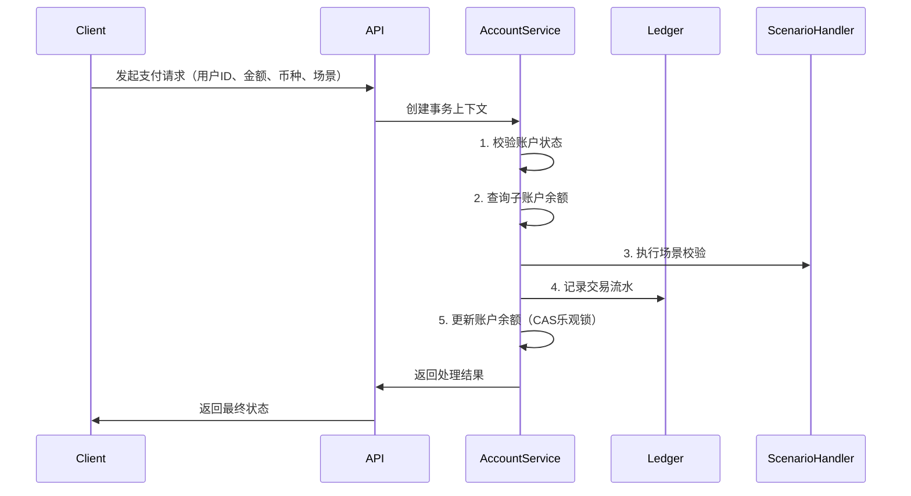

## 前言
在支付公司呆过多年之后，是时候汇总一些之前关于公司里面见到过、没见到过的支付领域的相关的知识，供日后翻阅回忆。

<!-- more -->

---

## **一、账务设计架构**
### 1. **核心概念**
#### 解释支付系统中的“会计科目”和“分户账”设计原则，为何需要复式记账？
在支付系统中，**会计科目**和**分户账**的设计原则以及**复式记账**的应用，是确保财务数据准确性和业务可靠性的核心机制。以下分点阐述：

##### **一、会计科目的设计原则**
- **全面性与层次性**  
   - 会计科目需覆盖所有业务场景（如资产、负债、收入、费用等），并通过多级科目细化管理。例如：  
     - **资产类**：银行存款（下设用户存款、备付金等子科目）  
     - **负债类**：应付账款（如商户待结算款项）  
     - **收入类**：手续费收入、跨境汇兑收益等。  
   - 层次性确保科目体系结构化，便于汇总与分析。
- **一致性**  
   - 科目命名和分类规则需统一，避免不同系统或业务线之间的歧义。例如，“用户存款”在所有场景下均指向同一科目。
- **可扩展性**  
   - 支持动态新增科目（如新增业务类型或支付渠道），同时保持与原有体系的兼容性。

##### **二、分户账的设计原则**
- **实时性与准确性**  
   - 每笔交易需实时更新分户账余额（如用户转账后立即反映账户变动），避免延迟导致账务不一致。  
   - 分户账需记录交易明细（时间、金额、对手方等），确保数据完整可查。
- **可追溯性**  
   - 通过唯一交易流水号关联分户账与总账，支持全链路审计。例如，用户投诉时能快速定位交易路径。
- **高效性**  
   - 采用分布式数据库或分片技术，应对高并发场景（如双十一支付高峰）。  
   - 索引优化提升查询效率，如按用户ID快速检索账户流水。
- **隔离性**  
   - 分户账需区分业务类型（如用户账户、手续费中间账户、备付金账户），避免资金混用。

##### **三、为何需要复式记账？**
- **确保账务平衡**  
   - 每笔交易同时在**至少两个科目**记录，保持“借贷相等”。例如：  
     - **用户A向用户B转账100元**：  
       - 借：用户B存款（+100）  
       - 贷：用户A存款（-100）  
   - 系统通过借贷平衡自动校验数据一致性，防止单边账（仅记录一方变动）。
- **支持全面核算**  
   - 复式记账能同时反映资金流向（如“从哪里来”和“到哪里去”），便于生成财务报表（如资产负债表、资金流水表）。
- **风险控制与审计**  
   - 任何异常（如借贷不平）可即时触发告警，辅助排查系统故障或欺诈行为。  
   - 审计时可通过双向记录验证交易真实性，符合金融监管要求。
- **适应复杂业务场景**  
   - 跨境支付中涉及货币兑换：  
     - 借：外币存款（按汇率折算）  
     - 贷：本币存款  
   - 手续费分润：  
     - 借：手续费支出（支付机构）  
     - 贷：手续费收入（银行/第三方渠道）。

##### **四、实际应用示例**
**场景**：用户通过支付宝向商户支付100元，手续费0.6元。  
- **会计科目**：  
   - 用户存款（负债类）  
   - 商户待结算款（负债类）  
   - 手续费收入（收入类）  

- **分户账记录**：  
   - **用户账户**：贷方-100元  
   - **商户账户**：贷方+99.4元（100元-0.6元手续费）  
   - **手续费中间账户**：贷方+0.6元  

- **复式记账分录**：  
   - 借：用户存款 100元  
   - 贷：商户待结算款 99.4元  
   - 贷：手续费收入 0.6元  

##### **总结**
- **会计科目**是支付系统的“分类框架”，确保资金按规则归集；  
- **分户账**是“明细记录”，保障每笔交易可追溯；  
- **复式记账**通过双向记录实现账务自洽，是支付系统稳健运行的基石。  
三者结合，共同支撑支付系统的高效性、准确性与合规性。

---

#### 如何保证交易流水与账户余额的一致性？举例说明“先记账，后更新余额”的流程。
在支付系统中，确保交易流水与账户余额的一致性至关重要。若两者出现偏差，可能导致资金错误、用户纠纷甚至系统崩溃。**“先记账，后更新余额”** 是一种通过事务机制保障强一致性的核心流程设计，以下详细说明其原理及实现示例：

##### **一、一致性保障的核心机制**
- **事务原子性（ACID）**  
   - 通过数据库事务的原子性（Atomicity），确保交易流水记录和余额更新操作**要么全部成功，要么全部回滚**，避免部分成功导致的脏数据。
- **锁定机制（Locking）**  
   - 使用悲观锁（如 `SELECT FOR UPDATE`）或乐观锁（版本号校验），防止并发操作导致余额错乱。
- **幂等性设计**  
   - 通过唯一交易流水号（如 `txn_id`）保证同一交易**仅处理一次**，避免重复扣款或入账。

##### **二、“先记账，后更新余额”流程示例**
以用户A向用户B转账100元为例：

- **步骤1：事务开启**
  ```sql
  BEGIN TRANSACTION; -- 开启事务
  ```
- **步骤2：插入交易流水（记账）**
  - 先写入流水记录，标记状态为 `pending`（处理中），确保后续操作可追溯：
  ```sql
  INSERT INTO transaction_log (txn_id, from_user, to_user, amount, status, created_at)
  VALUES ('TX123456', 'UserA', 'UserB', 100.00, 'pending', NOW());
  ```
- **步骤3：校验并锁定账户**
  - 检查用户A的余额是否足够，并通过锁防止并发修改：
  ```sql
  SELECT balance FROM user_account WHERE user_id = 'UserA' FOR UPDATE; -- 加锁
  -- 若余额不足，抛出异常并回滚事务（ROLLBACK）
  ```
- **步骤4：更新账户余额**
  - 扣减用户A余额，增加用户B余额：
  ```sql
  UPDATE user_account SET balance = balance - 100.00 WHERE user_id = 'UserA';
  UPDATE user_account SET balance = balance + 100.00 WHERE user_id = 'UserB';
  ```
- **步骤5：更新流水状态为成功**
  ```sql
  UPDATE transaction_log SET status = 'success' WHERE txn_id = 'TX123456';
  ```
- **步骤6：提交事务**
  ```sql
  COMMIT; -- 提交事务，释放锁
  ```

##### **三、异常场景处理**
###### **场景1：余额不足**
- 若步骤3中用户A余额不足，立即回滚事务，流水状态标记为 `failed`：
```sql
ROLLBACK;
UPDATE transaction_log SET status = 'failed', error_msg = 'Insufficient balance' WHERE txn_id = 'TX123456';
```

###### **场景2：系统崩溃或网络中断**
- 若事务未提交（如步骤4后崩溃），数据库自动回滚，余额和流水均恢复原状。

###### **场景3：并发冲突**
- 使用乐观锁（版本号）避免脏写：
```sql
-- 假设账户表有 version 字段
UPDATE user_account 
SET balance = balance - 100.00, version = version + 1 
WHERE user_id = 'UserA' AND version = 当前查询到的版本号;
-- 若影响行数为0，说明并发冲突，需重试或报错
```

##### **四、技术优化实践**
- **异步对账**  
   - 定时比对流水表与账户余额，发现不一致时触发告警和修复（如补单或冲正）。
- **分库分表与分布式事务**  
   - 若用户账户分库存储，采用分布式事务框架（如Seata）或最终一致性方案（如事务消息）。
- **预占额度设计**  
   - 针对高频场景（如秒杀），先预占额度再实际扣减，减少锁竞争：
  ```sql
  -- 预占阶段
  UPDATE user_account SET frozen_balance = frozen_balance + 100.00 WHERE user_id = 'UserA';
  -- 实际扣款阶段（异步）
  UPDATE user_account SET balance = balance - 100.00, frozen_balance = frozen_balance - 100.00 WHERE user_id = 'UserA';
  ```

##### **五、总结**
- **核心逻辑**：通过事务和锁机制，保证流水记录与余额更新**原子性执行**。
- **关键设计**：  
  - 先记录流水，再操作余额，避免“余额已变但流水丢失”的极端情况。  
  - 异常处理需结合事务回滚、幂等重试和对账机制。  
- **实际应用**：支付系统（如支付宝）、银行核心系统均采用类似设计，确保资金零差错。


---

#### 什么是“虚账户”与“实账户”？在电商预付款场景中如何应用？
在电商及金融系统中，“虚账户”与“实账户”是两类关键账户类型，分别承担不同的职能。以下是它们的定义、区别及在电商预付款场景中的应用解析：

##### **一、虚账户与实账户的定义**
- **1. 虚账户（Virtual Account）**
  - **定义**：虚账户是一种**逻辑账户**，用于记录交易流水或内部资金流转，不直接对应实际的资金存储。  
  - **特点**：  
    - **非资金托管**：虚账户的余额仅代表业务逻辑上的数值，资金实际存放于实账户中。  
    - **灵活管理**：支持动态分配（如用户分账、营销活动资金池）。  
    - **用途广泛**：常用于记录用户余额、积分、优惠券、预付款等。
- **2. 实账户（Physical Account）**
  - **定义**：实账户是**实际资金存储的账户**，直接关联银行或第三方支付机构的资金托管。  
  - **特点**：  
    - **资金托管**：实际资金存放于银行或支付机构的实体账户（如支付宝备付金账户）。  
    - **强监管**：需符合金融监管要求（如资金隔离、定期审计）。  
    - **用途明确**：处理真实的资金收付（如用户充值、商户结算）。
- **3. 核心区别**
  | **维度**       | **虚账户**                  | **实账户**                  |
  |----------------|-----------------------------|-----------------------------|
  | 资金性质       | 逻辑数值，不存实际资金       | 实际资金存储                |
  | 合规要求       | 无严格金融监管              | 需符合资金托管、反洗钱等法规 |
  | 操作灵活性     | 高（可频繁增减、拆分）       | 低（需严格匹配真实资金变动） |
  | 典型应用       | 用户余额、积分、预付款记录   | 备付金账户、银行存管账户     |

##### **二、电商预付款场景中的应用**
以用户充值预付款为例，虚账户与实账户的协同流程如下：

- **1. 用户充值100元至电商平台**
  - **实账户操作**：  
    - 用户通过支付渠道（如支付宝）向电商平台的**备付金实账户**转入100元。  
    - 资金实际进入银行的托管账户，受监管保护。  
  - **虚账户操作**：  
    - 平台在内部系统中为用户创建**虚账户**，记录“预付款余额+100元”。  
    - 虚账户仅作为用户权益的账面记录，不涉及真实资金变动。
- **2. 用户使用预付款购买商品（80元）**
  - **虚账户操作**：  
    - 扣除用户虚账户中的预付款余额80元，记录交易流水（订单号、金额、时间）。  
    - 虚账户余额更新为20元。  
  - **实账户操作**：  
    - 实际资金仍留在电商平台的备付金实账户中，暂未结算给商户。  
    - 待订单完成后，平台从备付金账户向商户的实账户结算80元。
- **3. 用户退款（取消订单）**
  - **虚账户操作**：  
    - 恢复用户虚账户余额80元，记录退款流水。  
  - **实账户操作**：  
    - 无需立即操作实账户，因资金尚未结算给商户，仍存于备付金账户中。  
    - 若已结算，需从商户实账户扣回资金（可能涉及复杂流程）。

##### **三、虚账户与实账户协同的优势**
- **风险隔离**  
   - 用户预付款资金统一存管于实账户（如银行备付金），避免平台挪用资金。  
   - 虚账户仅管理账面数值，降低资金操作风险。
- **灵活性与效率**  
   - 虚账户支持高频交易（如秒杀活动扣减余额），无需频繁操作银行账户。  
   - 实账户按监管要求处理大额结算，确保合规性。
- **对账与审计**  
   - 虚账户流水与实账户资金变动需定期核对，确保账实相符。  
   - 例如：虚账户总余额应等于备付金实账户中用户预付款的总额。
- **用户体验优化**  
   - 用户看到的“余额”是虚账户数值，可实时展示，提升体验。  
   - 实际资金结算可异步处理（如T+1结算给商户）。

##### **四、典型案例：电商平台的预付款体系**
- **京东钱包**：用户充值至京东的备付金实账户，虚账户记录“京东余额”；消费时扣除虚账户余额，结算时从实账户拨款给商户。  
- **美团月付**：用户使用信用额度（虚账户）消费，月末统一从用户绑定的银行卡（实账户）扣款。

##### **五、总结**
- **虚账户**是业务逻辑的“影子”，负责记录用户权益，**轻量、灵活**；  
- **实账户**是资金的“保险箱”，负责真实资金存管，**重安全、合规**；  
- **电商预付款场景中**，二者通过“虚账记权益，实账管资金”的分工，实现用户体验、资金安全与监管合规的平衡。

---

### 2. **系统设计**
#### 如何设计一个支持多币种、多场景（如红包、优惠券）的账户系统？
设计支持多币种、多场景的账户系统需要兼顾灵活性、扩展性和安全性，以下是详细设计方案：

##### 一、核心模型设计
- 1. **账户体系分层**
  ```mermaid
  graph TD
      A[主账户] --> B[币种维度]
      A --> C[场景维度]
      B --> B1[人民币子账户]
      B --> B2[美元子账户]
      C --> C1[红包子账户]
      C --> C2[优惠券子账户]
  ```
  
  - **主账户**：用户唯一标识，记录基础信息（用户ID、状态等）
  - **子账户**：
    - **币种维度**：每个币种独立记账（CNY/USD）
    - **场景维度**：红包账户、优惠券账户、积分账户等

- 2. 数据结构示例
  ```sql
  -- 主账户表
  CREATE TABLE user_account (
      account_id BIGINT PRIMARY KEY,
      user_id BIGINT NOT NULL,
      status TINYINT DEFAULT 1,
      version INT DEFAULT 0 -- 乐观锁版本号
  );
  
  -- 子账户表（分库分表键：user_id）
  CREATE TABLE sub_account (
      sub_account_id BIGINT PRIMARY KEY,
      account_id BIGINT NOT NULL,
      currency VARCHAR(3) NOT NULL, -- ISO 4217标准
      scenario_type VARCHAR(20) NOT NULL, -- 红包/优惠券/积分
      balance DECIMAL(18,4) NOT NULL,
      freeze_balance DECIMAL(18,4) DEFAULT 0,
      expire_time DATETIME -- 场景特有属性
  );
  ```

##### 二、多币种处理方案
- 1. 币种管理
  - **币种注册表**：维护支持的币种列表（ISO 4217标准）
  - **汇率服务**：
    - 对接外部API（如XE.com）获取实时汇率
    - 定时任务缓存汇率快照（每小时更新）
    - 支持历史汇率查询（用于对账）
- 2. 跨币种交易
  ```python
  def convert_currency(amount, from_currency, to_currency):
      rate = get_exchange_rate(from_currency, to_currency)
      return amount * rate
  
  # 示例：用美元红包支付人民币订单
  usd_balance = get_sub_account(user_id, 'USD', 'RED_PACKET')
  cny_amount = convert_currency(order_amount, 'CNY', 'USD')
  if usd_balance >= cny_amount:
      deduct_balance(user_id, 'USD', 'RED_PACKET', cny_amount)
  ```

##### 三、多场景支持策略
- 1. 场景扩展机制
  ```java
  // 策略模式实现不同场景处理
  public interface ScenarioHandler {
      void validate(TransactionContext context);
      void execute(TransactionContext context);
  }
  
  // 红包场景处理器
  @Component
  public class RedPacketHandler implements ScenarioHandler {
      @Override
      public void validate(TransactionContext ctx) {
          if(ctx.getSubAccount().getExpireTime().before(new Date())) {
              throw new ExpiredException("红包已过期");
          }
      }
  }
  
  // 优惠券场景处理器
  @Component 
  public class CouponHandler implements ScenarioHandler {
      @Override
      public void validate(TransactionContext ctx) {
          if(ctx.getOrderAmount() < ctx.getSubAccount().getThreshold()) {
              throw new RuleViolationException("未达到使用门槛");
          }
      }
  }
  ```
- 2. 场景特有属性
  - **红包**：有效期、使用范围限制
  - **优惠券**：折扣类型（满减/百分比）、使用门槛
  - **积分**：有效期、可兑换比例

##### 四、核心交易流程


##### 五、关键问题解决方案
- 1. 资金安全
  - **分布式事务**：采用TCC模式（Try-Confirm-Cancel）
  - **幂等控制**：客户端生成唯一请求ID（UUID）
  - **对账系统**：每日核对账户余额与流水汇总
- 2. 高性能设计
  - **热点账户**：采用账户分段（如把红包账户拆分为100个虚拟子账户）
  - **缓存策略**：Redis缓存高频访问的账户余额（需保证最终一致性）
  - **批量处理**：合并小额余额变动操作
- 3. 特殊场景处理
  - **红包过期**：定时任务扫描即将过期账户，触发退回原路
  - **跨境结算**：对接SWIFT等国际清算系统
  - **监管合规**：记录完整交易流水，支持反洗钱（AML）检查

##### 六、监控指标
- 账户余额变动告警阈值（单笔>100万）
- 汇率更新时间偏差监控
- 子账户状态异常（长时间冻结）
- 交易失败率（按场景统计）

##### 总结
通过以上设计，系统可实现：
- **横向扩展**：通过用户ID分片支持亿级账户
- **业务扩展**：新增场景只需实现ScenarioHandler接口
- **资金安全**：多重校验+完整审计追踪
- **全球服务**：支持150+国家币种，自动处理汇率转换

---

#### 分库分表策略：按用户ID哈希分片 vs 按交易时间范围分区，各自的优缺点？
以下是分库分表策略中 **按用户ID哈希分片** 和 **按交易时间范围分区** 的详细对比分析，结合核心业务场景说明其优缺点及适用性：

##### **一、按用户ID哈希分片**
###### **核心逻辑**
- 将用户ID通过哈希算法（如CRC32、一致性哈希）映射到固定数量的分片（库/表）中。  
- **典型公式**：`分片序号 = hash(user_id) % N`，其中N为分片总数。

###### **优点**
- **数据均匀分布**  
   - 用户请求分散到不同分片，避免热点问题（如大商户或高频用户集中访问单一节点）。  
   - **适用场景**：用户访问量均衡的C端业务（社交、电商）。
- **横向扩展灵活**  
   - 增加分片数量后，通过一致性哈希减少数据迁移量（仅需迁移部分数据）。  
   - **适用场景**：用户规模持续增长但无明显时间热点的系统。
- **用户维度的查询高效**  
   - 直接通过用户ID定位分片，避免跨分片查询。  
   - **适用场景**：高频的用户中心化操作（如查询个人订单、账户余额）。

###### **缺点**
- **跨分片查询复杂**  
   - 统计全局数据（如全平台交易总额）需聚合多个分片，性能低下。  
   - **规避方案**：通过Elasticsearch或OLAP数据库构建离线统计。
- **扩容成本高**  
   - 传统哈希取模扩容需全量数据迁移（如从2库扩展到4库）。  
   - **优化方案**：采用一致性哈希或虚拟分片技术减少迁移量。
- **时间范围查询低效**  
   - 查询某时间段内的所有用户数据需扫描全部分片。  
   - **规避方案**：建立时间+用户ID的联合索引或冷热数据分离。

##### **二、按交易时间范围分区**
###### **核心逻辑**
- 按时间（如按月/季度）划分数据，例如：`交易表_2023Q1`、`交易表_2023Q2`。  
- 可结合时间范围进一步分库（如每年一个库）。

###### **优点**
- **时间维度的查询高效**  
   - 直接定位到特定时间分片，避免全表扫描。  
   - **适用场景**：报表统计（如月度营收）、审计追溯。
- **数据生命周期管理便捷**  
   - 直接删除或归档过期分片（如删除3年前数据）。  
   - **适用场景**：日志系统、监管要求保留特定时长的交易记录。
- **扩容简单**  
   - 新增时间段分片无需调整历史数据。  
   - **适用场景**：数据按时间线性增长的场景（如物联网时序数据）。

###### **缺点**
- **热点问题突出**  
   - 最新分片（如当前月份）承受绝大部分读写压力。  
   - **规避方案**：结合用户ID哈希在时间分片内二次分表。
- **用户维度的查询低效**  
   - 查询某用户的历史数据需跨多个时间分片。  
   - **规避方案**：建立用户ID与时间的联合索引（如`user_id + create_time`）。
- **数据分布不均**  
   - 随时间推移，不同分片的数据量可能差异巨大（如促销月份数据激增）。  
   - **优化方案**：动态调整时间分片粒度（如大促月份独立分片）。

##### **三、对比总结**
| **维度**               | **按用户ID哈希分片**                          | **按交易时间范围分区**                  |
|-----------------------|--------------------------------------------|-------------------------------------|
| **数据分布**           | 均匀                                        | 可能不均匀（时间热点）                     |
| **查询效率**           | 用户维度高效，时间维度低效                     | 时间维度高效，用户维度低效                 |
| **扩展性**             | 扩容需数据迁移，成本较高                       | 直接新增分片，成本低                      |
| **适用场景**           | 用户中心化业务（C端应用）                      | 时间序列业务（日志、金融交易记录）           |
| **典型系统**           | 社交用户表、电商订单表                        | 银行流水表、IoT传感器数据                 |

##### **四、混合方案实践**
**场景：支付系统交易表**
- **一级分片：按时间分区**  
   - 按月份分库，如 `trade_db_202301`、`trade_db_202302`。  
   - **目的**：快速归档旧数据，优化时间范围查询。
- **二级分片：按用户ID哈希**  
   - 每个时间库内再分16张表（`user_id % 16`）。  
   - **目的**：分散同一月份内的用户请求，避免热点。
- **查询优化**  
   - **按时间查**：直接路由到对应月份库。  
   - **按用户+时间查**：先定位月份库，再通过用户ID哈希找到具体表。

##### **五、选择建议**
- **优先哈希分片**：若业务以用户为中心（如90%查询依赖`user_id`）。  
- **优先时间分区**：若业务依赖时间范围分析（如金融对账、日志审计）。  
- **混合分片**：高并发且需兼顾两种查询的场景（如支付交易表）。  
- **补充说明**：NoSQL（如HBase、Cassandra）的自动分片机制可减少人工设计成本。

---

#### 高并发下如何避免余额扣减的超卖问题？举例说明“CAS乐观锁”或“事务消息”的实现。
在高并发场景下，避免余额扣减超卖（即“余额透支”）是金融和电商系统的核心挑战之一。以下是两种主流解决方案的详细实现逻辑及示例：


##### **一、CAS（Compare and Swap）乐观锁方案**
###### **核心原理**
通过版本号或条件判断，在更新余额时校验数据未被其他事务修改，若校验失败则重试或终止。

###### **实现步骤（以MySQL为例）**
1. **查询当前余额并获取版本号**  
   ```sql
   SELECT balance, version FROM account WHERE user_id = 123;
   -- 假设返回 balance=100, version=1
   ```
2. **业务层校验余额充足性**  
   ```java
   if (balance >= 扣减金额) {
       // 允许继续操作
   } else {
       throw new InsufficientBalanceException();
   }
   ```
3. **CAS更新（带版本号校验）**  
   ```sql
   UPDATE account 
   SET balance = balance - 50, version = version + 1 
   WHERE user_id = 123 
     AND version = 1  -- 校验版本号未被修改
     AND balance >= 50; -- 双重校验防止并发穿透
   ```
4. **判断更新结果**  
   - 若影响行数（affected rows）为1：扣减成功。  
   - 若为0：说明版本号或余额已变更，需重试或返回失败。

###### **适用场景**
- 单行数据高频更新的场景（如用户账户余额）。  
- 对性能要求较高且冲突概率较低的系统。

###### **优缺点**
- **优点**：无锁竞争，性能高。  
- **缺点**：需处理重试逻辑；高并发下重试压力可能加剧。


##### **二、事务消息方案（以RocketMQ为例）**
###### **核心原理**
通过消息队列解耦业务操作与余额扣减，利用事务消息确保最终一致性。

###### **实现步骤**
1. **发送预扣消息（半消息）**  
   ```java
   TransactionMQProducer producer = new TransactionMQProducer("group");
   Message msg = new Message("deduct_topic", "扣减50元".getBytes());
   SendResult sendResult = producer.sendMessageInTransaction(msg, null);
   ```
2. **执行本地事务（预扣余额）**  
   ```java
   public LocalTransactionState executeLocalTransaction(Message msg, Object arg) {
       try {
           // 预扣记录写入预扣表（状态为"处理中"）
           deductDao.insertPreDeduct(userId, 50, "PENDING");
           return LocalTransactionState.COMMIT_MESSAGE;
       } catch (Exception e) {
           return LocalTransactionState.ROLLBACK_MESSAGE;
       }
   }
   ```
3. **消息消费者执行最终扣减**  
   ```java
   consumer.subscribe("deduct_topic", (msg, context) -> {
       // 查询预扣记录
       PreDeduct preDeduct = deductDao.getPreDeduct(msg.getUserId());
       if (preDeduct.getStatus().equals("PENDING")) {
           // 实际扣减余额（需保证幂等性）
           int rows = accountDao.deductBalance(userId, 50);
           if (rows > 0) {
               deductDao.updatePreDeductStatus(preDeduct.getId(), "SUCCESS");
           } else {
               deductDao.updatePreDeductStatus(preDeduct.getId(), "FAILED");
           }
       }
       return ConsumeConcurrentlyStatus.CONSUME_SUCCESS;
   });
   ```
4. **定时任务补偿对账**  
   - 扫描预扣表中长时间未完成的记录，触发回查或人工干预。

###### **适用场景**
- 分布式系统跨服务调用的场景（如支付与账户分离）。  
- 需要高吞吐量且允许短暂延迟最终一致性的业务。

###### **优缺点**
- **优点**：削峰填谷，降低数据库压力；天然支持分布式事务。  
- **缺点**：实现复杂度高；存在短暂延迟（非实时扣减）。

##### **三、两种方案的对比与选择建议**
| **维度**         | **CAS乐观锁**                          | **事务消息**                                |
|------------------|---------------------------------------|------------------------------------------|
| **实时性**       | 实时扣减                               | 最终一致性（延迟通常<1秒）                   |
| **性能**         | 高（无锁竞争）                         | 极高（异步削峰）                           |
| **复杂度**       | 低（需重试逻辑）                       | 高（需消息队列、幂等、对账）                 |
| **适用场景**     | 单库事务、低冲突率                     | 分布式系统、高并发大流量                     |
| **典型业务**     | 用户余额实时扣减                       | 电商库存秒杀、红包分配                       |

##### **四、补充优化策略**
1. **令牌桶限流**  
   - 在网关层限制并发请求量，避免瞬时流量压垮数据库。
2. **Redis预扣减**  
   - 使用Redis原子操作（`DECRBY`）快速拦截超额请求，再异步同步到数据库。  
   ```java
   Long result = redisTemplate.opsForValue().decrement("balance:123", 50);
   if (result < 0) {
       redisTemplate.opsForValue().increment("balance:123", 50); // 回滚
       throw new InsufficientBalanceException();
   }
   ```
3. **分桶余额**  
   - 将用户余额拆分为多个子账户（如10个子桶），分散锁竞争。  
   ```sql
   -- 随机选择一个子桶扣减
   UPDATE account_bucket 
   SET balance = balance - 5 
   WHERE user_id = 123 
     AND bucket_id = RAND() * 10 
     AND balance >= 5;
   ```

##### **五、总结**
- **CAS方案**：适合强一致性的简单场景，需注意重试策略和版本号设计。  
- **事务消息**：适合大规模分布式系统，通过异步化和削峰保障系统稳定。  
- **混合使用**：例如用Redis拦截大部分请求，CAS保证最终准确性，事务消息处理异步任务。

---

### 3. **数据一致性与容灾**
#### 分布式事务场景下，如何实现“最终一致性”？（可答Saga/TCC模式）


---

#### 对账系统设计：如何通过“轧差”快速定位差异？核心对账字段有哪些？

---

#### 若主库故障，如何通过“本地消息表”或“binlog同步”恢复数据？

---

## **二、清算与结算**
### 1. **基础概念**
- 清算（Clearing）与结算（Settlement）的区别是什么？以银行卡交易为例说明流程。
- 什么是“轧差”（Netting）？在跨境支付中如何降低结算成本？
- 解释“D+0”、“T+1”结算模式，及各自的资金风险。

### 2. **流程与优化**
- 清算文件（如银联的CUP文件）解析失败如何处理？如何实现自动重试与人工干预？
- 如何设计一个支持多通道（银行、三方支付）的结算路由系统？
- 在实时结算场景中，如何保证资金划付的幂等性？

### 3. **合规与风控**
- 反洗钱（AML）在清算中的实践：大额交易监控规则如何设计？
- 跨境结算中如何应对汇率波动风险？举例说明“锁汇”操作。
- 结算失败（如银行退票）的自动化处理流程如何设计？

### 常见清算系统架构及相关问题

在支付领域中，清结算系统是资金流转的核心环节，其架构设计需兼顾高效性、安全性与可靠性。以下是系统架构及常见问题的分析：

#### **一、清结算系统架构**
**1. 分层架构设计**
- **接入层**  
   - **功能**：处理外部请求（如商户、银行、第三方支付渠道），负责协议转换（HTTP/API/SFTP）、鉴权、流量控制等。  
   - **技术选型**：Nginx/API网关、分布式限流（Sentinel）等。
- **业务处理层**  
   - **交易核心**：处理支付、退款等交易，生成原始流水。  
   - **风控模块**：实时反欺诈（如规则引擎）、交易限额控制。  
   - **技术要点**：异步化处理（MQ解耦）、幂等性设计。
- **清算层**  
   - **对账引擎**：  
     - **交易对账**：核对支付机构与银行渠道的交易数据（如订单号、金额）。  
     - **资金对账**：确保账面资金与实际结算金额一致。  
   - **差错处理**：自动修复短款/长款（如重试、冲正）、人工干预接口。  
   - **技术实现**：分布式任务调度（如XXL-JOB）、文件解析（银行对账文件）。
- **结算层**  
   - **结算规则引擎**：根据合同计算分润（如商户手续费、平台抽成）。  
   - **资金划付**：通过银企直连或第三方支付渠道完成出款。  
   - **合规审计**：留存结算凭证，满足监管要求（如备付金管理）。  
   - **技术要点**：分布式事务（TCC模式）、与银行系统的加密通信（国密算法）。
- **数据层**  
   - **数据库**：交易流水（MySQL分库分表）、对账结果（ClickHouse分析）。  
   - **文件存储**：原始对账文件（OSS/MinIO）、日志（ELK）。

#### **二、常见问题及解决方案**
- **1. 数据一致性挑战**
  - **场景**：交易成功但结算失败（如银行系统超时）。  
  - **方案**：  
    - **最终一致性**：通过MQ重试 + 补偿机制（如反向冲正交易）。  
    - **对账兜底**：日终对账修复差异数据。
- **2. 高并发与性能瓶颈**
  - **场景**：大促期间海量交易导致清算延迟。  
  - **方案**：  
    - **异步批处理**：将实时清算改为定时批次任务。  
    - **分片处理**：按商户ID分片并行对账。
- **3. 资金安全风险**
  - **场景**：结算重复出款（如网络超时重试导致重复请求）。  
  - **方案**：  
    - **幂等设计**：结算单号全局唯一，数据库唯一索引拦截重复请求。  
    - **多重审核**：大额出款需人工二次确认。
- **4. 对账差错处理**
  - **常见差错类型**：  
    - **单边账**：一方成功另一方失败（如银行扣款成功但未返回通知）。  
    - **金额差异**：手续费计算误差或汇率波动。  
  - **自动化处理**：预设规则自动调账（如差值小于0.01元视为一致）。  
  - **人工介入**：复杂差异生成工单由运营处理。
- **5. 系统扩展性与合规性**
  - **多渠道适配**：抽象银行/第三方支付接口，通过适配器模式快速接入新渠道。  
  - **监管合规**：  
    - **数据隔离**：跨境支付需满足本地数据存储要求（如GDPR）。  
    - **审计追踪**：记录资金流向，支持监管报表生成。

#### **三、关键技术实践**
- **分布式事务**：Seata框架保证跨服务事务一致性。  
- **实时监控**：Prometheus + Grafana监控清算延迟、差错率等指标。  
- **灾备设计**：多机房部署，对账文件多地备份。  


---

## 清结算核心业务

### **一、核心业务流程**
- **交易处理**  
   - **功能**：记录支付/退款交易流水，生成原始数据。  
   - **关键点**：幂等性（防重复）、风控拦截（如反欺诈）、交易状态同步。
- **清分（Clearing）**  
   - **功能**：根据规则计算各方（商户、平台、渠道）应得资金。  
   - **关键点**：手续费计算、分润规则引擎、汇率转换（跨境场景）。
- **对账（Reconciliation）**  
   - **内部对账**：核对交易系统与清分系统的数据一致性。  
   - **外部对账**：与银行/第三方渠道核对交易和资金流水。  
   - **输出**：生成差异报表（长款、短款、金额不符等）。
- **结算（Settlement）**  
   - **功能**：将清分后的资金划付至各方账户。  
   - **关键点**：结算批次生成、出款指令加密、银行接口调用。
- **资金划付**  
   - **执行**：通过银企直连或第三方支付完成实际资金转账。  
   - **确认**：接收银行回执，更新结算状态。

### **二、常见异常场景及解决方案**
#### **1. 数据不一致**  
- **场景**：  
  - 交易系统记录成功，但清分系统未收到数据（网络丢包）。  
  - 银行渠道返回成功，但本地系统标记失败（异步通知丢失）。  
- **解决方案**：  
  - **对账修复**：通过日终对账文件自动补单或冲正。  
  - **重试机制**：MQ消息重试 + 人工干预接口。  

#### **2. 单边账（Unilateral Transaction）**
- **场景**：  
  - 银行已扣款，但商户未收到成功通知（超时未回调）。  
  - 支付渠道返回失败，但实际资金已划出（状态同步延迟）。  
- **解决方案**：  
  - **自动冲正**：基于超时阈值触发反向交易。  
  - **人工核查**：提供运营查询工具，手动补发通知。  

#### **3. 结算失败**
- **场景**：  
  - 银行账户余额不足（如平台备付金不足）。  
  - 银行接口超时或返回错误（如网络抖动、参数错误）。  
- **解决方案**：  
  - **熔断降级**：暂停异常渠道结算，切换备用通道。  
  - **定时重试**：失败任务进入队列，按策略重试（如指数退避）。  

#### **4. 高并发延迟**
- **场景**：  
  - 大促期间海量交易导致清分任务积压。  
  - 对账文件解析耗时过长，影响结算时效性。  
- **解决方案**：  
  - **分片处理**：按商户/渠道拆分任务并行执行。  
  - **异步化**：清分与结算解耦，通过消息队列削峰填谷。  

#### **5. 重复结算**
- **场景**：  
  - 出款指令因超时重试导致重复打款。  
  - 结算任务调度异常触发多次执行。  
- **解决方案**：  
  - **幂等设计**：结算单号全局唯一，数据库唯一索引拦截重复请求。  
  - **出款前校验**：调用银行余额查询接口，确认未执行成功后再发起。  

#### **6. 合规与审计风险**
- **场景**：  
  - 跨境结算未满足当地数据存储要求（如GDPR）。  
  - 监管报表数据缺失或延迟。  
- **解决方案**：  
  - **数据隔离**：分区域部署清结算节点，本地化存储交易数据。  
  - **日志归档**：全链路操作日志留存，支持快速审计追踪。  

### **三、关键设计原则**
- **自动化优先**：90%以上的差异通过规则引擎自动修复。  
- **监控全覆盖**：实时告警交易/结算成功率、对账差异率等核心指标。  
- **资金零信任**：所有操作需多重校验（如出款前二次签名）。  
- **容错设计**：假设外部系统不可靠（如银行接口超时），通过异步确认+补偿机制兜底。  

### **总结**
清结算系统的核心目标是保障资金流转的 **准确、及时、安全**。通过分层架构解耦业务流程、自动化对账修复差异、分布式设计应对高并发，并结合严格的幂等与风控机制，可有效解决数据不一致、单边账、重复结算等典型问题。同时，需持续优化监控与合规能力，以应对支付行业的强监管要求。

---

## **三、会员与账户架构**
### 1. **账户体系**
- 如何设计会员账户的“层级结构”（如主账户、子账户、影子账户）？
- 会员身份认证：多因素认证（MFA）在支付中的落地实践。
- 解释“KYC”（Know Your Customer）流程，如何通过OCR+活体检测优化用户体验？

### 2. **安全与合规**
- 如何防止会员账户的“羊毛党”攻击？举例限流、设备指纹、行为分析策略。
- 敏感信息（如银行卡号）的存储加密方案？是否使用Token化技术？
- GDPR或《个人信息保护法》对会员数据存储的影响？如何实现数据脱敏？

### 3. **扩展性设计**
- 会员等级与权益系统：如何实现动态规则配置（如积分倍率、费率折扣）？
- 如何通过“事件驱动架构”解耦会员系统与营销系统？
- 会员增长场景下，数据库从1万用户扩展到1亿用户的架构演进路径？

---

## **四、开放设计题**
- **场景设计**  
   “设计一个跨境电商平台的支付系统，支持多币种收款、分账给海外供应商，并满足当地合规要求。”  
   - 需涵盖：货币转换、清结算时效、分账API设计、合规报送（如税务）等。

- **故障处理**  
   “某日交易量激增10倍，部分用户余额显示错误，如何快速定位问题？”  
   - 考察点：监控指标（DB负载/缓存击穿）、降级方案（静态余额计算）、日志追踪。

- **技术选型**  
   “在账务核心系统中，选择关系型数据库还是分布式NewSQL？为什么？”  
   - 关键点：ACID需求、横向扩展能力、金融级一致性要求。

---

## **最佳实践补充**
- **幂等性**：所有支付接口必须支持幂等键（如`idempotency_key`）。
- **审计追溯**：关键操作需记录完整上下文（如用户IP、设备指纹、操作流水）。
- **灰度与降级**：新通道上线时，按比例灰度路由；异常时自动切换备用通道。

---

## 热点账户（Hot Account）
在支付系统中，**热点账户（Hot Account）** 是指在高并发场景下，同一账户（如平台商户账户、红包账户等）被频繁读写，导致数据库或服务出现性能瓶颈（如锁竞争、CPU/IO过载），甚至引发系统崩溃。以下是针对热点账户问题的解决方案及最佳实践：

---

### **一、热点账户的典型场景**
- **高频入账**：如电商大促时，所有用户支付的资金集中到同一平台账户。
- **高频出账**：如红包活动，用户同时从活动账户领取红包。
- **高频查询**：如余额查询接口被频繁调用。

---

### **二、核心解决思路**
- **1. 账户拆分（分桶策略）**
- **原理**：将一个逻辑账户拆分为多个物理子账户（分桶），分散并发压力。
- **实现**：
  - **按用户ID哈希分桶**：例如将用户ID尾号取模，分配到不同子账户。
  - **按时间分桶**：如按小时/天生成子账户，每天结束时合并统计。
- **案例**：支付宝的商户账户拆分为多个虚拟子账户，交易时随机选择子账户入账。
- **优点**：直接分散写压力；**缺点**：需处理子账户合并及对账。

- **2. 缓存优化（读写分离）**
- **读优化**：
  - **本地缓存**：在应用层缓存余额（如Redis + 本地缓存），设置短过期时间（如100ms）。
  - **最终一致性**：通过监听数据库Binlog异步更新缓存。
- **写优化**：
  - **缓冲队列**：将账户更新请求写入队列（如Kafka），由异步任务批量合并更新。
  - **合并操作**：将多次增减合并为一次`UPDATE account SET balance = balance + Δ`，减少锁竞争。

- **3. 数据库层优化**
- **无锁化设计**：
  - 使用数据库的**原子操作**（如MySQL的`UPDATE ... SET balance = balance + ?`），避免显式锁。
  - 采用**乐观锁**（版本号或CAS机制），减少锁冲突。
- **分库分表**：
  - 按账户ID分片，将热点账户的请求分散到不同数据库实例。
  - 若无法拆分，可单独为热点账户配置高性能实例（如SSD、内存优化）。

- **4. 异步化与批量处理**
- **异步记账**：
  - 先记录流水（高吞吐），异步更新余额（最终一致性）。
  - 适用于允许短暂延迟的场景（如红包到账通知）。
- **批量合并**：
  - 将短时间内多次更新合并为单次批量操作（如合并10次+10元为1次+100元）。

- **5. 限流与降级**
- **服务限流**：对热点账户的接口限流（如令牌桶算法），防止雪崩。
- **降级策略**：
  - 极端情况下，返回静态缓存余额（如“余额可能存在延迟”提示）。
  - 将同步操作降级为异步（如提示“资金将在5分钟内到账”）。

---

### **三、实战案例**
#### **案例1：电商平台商户账户入账**
- **问题**：双11期间，所有用户支付到同一平台账户，导致数据库TPS飙升。
- **方案**：
  1. **分桶设计**：将平台账户拆分为100个子账户，按订单ID哈希选择子账户。
  2. **合并更新**：每10ms批量合并子账户的余额变动，减少DB操作次数。
  3. **缓存兜底**：查询时优先读缓存，缓存失效时从子账户汇总计算。

#### **案例2：红包账户高频领取**
- **问题**：用户同时领取红包，导致红包账户余额超扣。
- **方案**：
  1. **预分配策略**：提前将红包金额分配到用户子账户（如Redis），领取时无需更新主账户。
  2. **分布式锁**：使用Redis Lua脚本实现原子化扣减，避免超卖。
  3. **异步对账**：每隔5分钟同步子账户数据到主库。

---

### **四、最佳实践总结**
| **方案**          | **适用场景**                     | **优点**                  | **注意事项**                     |
|-------------------|----------------------------------|---------------------------|----------------------------------|
| 账户分桶          | 高频写入（入账/出账）           | 分散压力，简单有效        | 需处理子账户合并与对账           |
| 缓存+异步批量更新 | 允许短暂延迟的余额查询/更新      | 显著降低DB负载            | 需保证最终一致性                 |
| 数据库原子操作    | 简单增减场景（如余额扣减）       | 避免锁竞争，高性能        | 需处理幂等性和失败重试           |
| 限流降级          | 突发流量或系统过载               | 防止系统崩溃              | 需结合用户体验设计友好提示       |

---

### **五、进阶思考**
- **如何监控热点账户？**  
   - 通过实时监控DB的QPS、锁等待时间、慢查询等指标，结合业务日志识别热点账户。
- **金融级一致性如何保证？**  
   - 使用分布式事务（如TCC）或本地消息表，确保“流水记录”与“余额更新”强一致。
- **是否可以用NewSQL数据库？**  
   - 如TiDB的乐观锁、高可用特性可缓解热点问题，但需评估成本和迁移风险。


---

## 分布式一致性hash
分布式一致性哈希在支付领域的落地实践场景主要包括以下几个方向，结合其特性如动态扩缩容、数据均衡分布和最小化数据迁移，可有效提升系统的稳定性和扩展性：

### 1. **支付请求的负载均衡与路由**
   - **场景**：将用户支付请求均匀分配到多个服务节点，应对高并发。
   - **应用**：
     - 使用一致性哈希动态分配请求至服务器，新增或下线节点时仅影响相邻节点，避免全局重新哈希。
     - 结合虚拟节点解决物理服务器性能不均问题，实现更均衡的负载。

### 2. **分库分表的数据存储优化**
   - **场景**：海量交易数据分片存储，避免单库性能瓶颈。
   - **应用**：
     - 按商户ID或用户ID哈希值分配数据到特定数据库分片，减少节点增减时的数据迁移量。
     - 通过虚拟节点设计预防数据倾斜，确保各分片负载均衡。

### 3. **分布式缓存管理**
   - **场景**：高频访问数据（如用户信息、交易状态）的缓存加速。
   - **应用**：
     - 一致性哈希定位缓存节点，节点变化时仅部分缓存失效，降低击穿风险。
     - 支持缓存集群弹性扩缩容，提升系统响应速度。

### 4. **支付通道的动态路由**
   - **场景**：智能选择支付渠道（如银行、第三方支付），提升成功率与成本效益。
   - **应用**：
     - 按商户或用户哈希值固定映射到特定通道，保障事务连续性。
     - 通道故障时自动路由至备用节点，结合重试机制保障交易完成。

### 5. **分布式任务调度**
   - **场景**：定时任务（如对账、清算）的分布式处理。
   - **应用**：
     - 哈希分配任务到工作节点，确保任务分布均衡。
     - 节点动态变化时自动迁移任务，提高任务执行可靠性。

### 6. **多活架构与容灾设计**
   - **场景**：多地数据中心协同，实现故障快速切换。
   - **应用**：
     - 按用户地域哈希路由至最近数据中心，降低延迟。
     - 数据中心故障时，请求自动转移至其他节点，保障服务高可用。

### 7. **消息队列分区管理**
   - **场景**：支付订单消息的顺序处理与并行消费平衡。
   - **应用**：
     - 一致性哈希分配消息到指定分区，确保同一订单消息有序。
     - 动态扩展分区节点时，最小化消息重新分配的影响。

### **注意事项**
- **虚拟节点**：大量虚拟节点可优化负载均衡，避免物理节点性能差异导致的热点。
- **数据一致性**：在支付等强一致性场景，需结合分布式事务或异步补偿机制。
- **健康检查**：动态路由需实时监测节点状态，及时剔除故障节点。

通过上述实践，一致性哈希能够提升支付系统的伸缩性和稳定性，但需结合实际业务需求进行参数调优（如虚拟节点数量）和容错设计，确保最终业务一致性。

